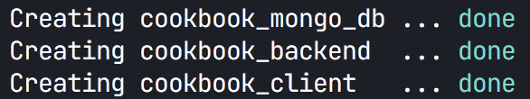

# dephion Code challenge  

This is a simple fullstack Project for a cookbook webapp with React.
This project is containerized with Docker and there is a `docker-compose.yml` file in the root directory to manage the services.

There are 3 services involved in this project:

1. Database Service (cookbook_mongo_db)
2. Backend Service (cookbook_backend)
3. Client Service (cookbook_client)

Here is the picture of docker containers which are active:

## Thoughts on this project

first of all before began this project, i decided to plan for it and takes me hours to figure out the whole structure, and finally i created this mindmap of my thoughts on this project which is avaliable at [My Mind Map on This Project](https://coggle.it/diagram/X2JesTfdS29D6YhB/t/cookbook)

this was really **important step** for me, b/c it directs me in my way of building the project!

## Introduction

In this project i chosed to use MERN stack, for Database i used mongoDb, for backend i used NodeJs with and the casual `mongoose` ORM, for client side i used React and Redux with styled-components for styling.

### back-end

I created a RestFull API for backend and definitely it could be scaled as a graphQl service ( may be next step on this project ;), and i used Joi in to validate data that comes with request in order to get clean input from client side to prevent insert the bad data to databse.

I also created the user flow for this project and when you login to the app, it will give you a JWT token which will expires in 30 days, and for refresh token, i tried to take it simple and did not implement it for the sake of time!

also i did not created the DTOs for domain and resources, just to handle the backend as fast as possible.

It is worth noting that there is a directory at `server/postman` which includes two files, the post man collection, and the postman environment. you can import them and use the RestFull Api provided by backend container!
Here is the picture of postman collection:

### front-end

In the client side i used the container way of structuring the project and I put commonly used components in to the `client/src/components` folder, I lazy load each Container's redux state, and therefore i worked my entire project in modular way that each container has its own redux folder and other stuff like context, styles and other ones to make it easily managable and maintainable!

some of features that i did in my client side project that worth mentioning:

- used immer for having a great performance on updating the store
- used formik for managing the forms
- used Yup for validationg the form inputs that mixes well with Formik
- used `redux-persist` in order to persist the global user data in user session
- and many more...

So lets dive in to the booting the project up!

## How to Run the Project?

Pre requisits:

- you need to install [Docker](https://docs.docker.com/get-docker/) in your Computer!
- you need to install the [Docker-compose](https://docs.docker.com/compose/install/)
- you may want to have postman app installed on you computer for intracting with API that comes on backend project, [install it from here](https://www.postman.com/downloads/)

also no that I have included the `.env` files in this project, so there is no need to do any thing ( im aware that i should not do this, and how bad practice it is, but i wanted to make the steps easy as possible )

## Steps:

1. clone the repository and `cd` inside of it.
2. run `docker-compose up -d`, this step would create 3 containers from scratch at the first time, and i can say that when creating the `cookbook_client` container, it would take some time to install pkgs for react prject, and since it is in silence mode, you would see nothing when it comes to run `npm run install` command, so don't be worry about being stuck or something else, just wait for almost 2 mins, it will install and create the container! at the end of this step you would see something like this:
   

3. congrats, you did it! now you can open the `http://localhost:4000/` and see that client side is ready!, in this state you will see 6 pre defined categories, and there are no recipe, you need to register a user and create recipe from your profile page!

---

## here is the list of Services:

- mongoDb is on PORT 27021 avaliable with user:root, pass: examplePass, connect with [compass](https://docs.mongodb.com/compass/master/install/)
- backend is avaliable on `http://localhost:4010/api/v1.0/`
- client is ready on `http://localhost:4000/`

---

please notice that screenshots are avcaliable at `./docs/` directory.

also please note that i had implemented some basic categories and actually you going to have 6 category avaliable by default in the project. Also i have to mention that the image uplaoding issue resolved in this fix and please accept my apology for that!

## What I might do in next step:

also there is alot of improvments i can make on this:

1. i might make it **responsive**
2. i might use **typescript** for typechecking
3. use **snapshot**, **unit** and **integration** test in client side also for backend side might use unit and **integration** tests ( please note that this is a must! and i do it in most of my projects, but for lack of time i could not implement it)
4. definitly this is not a bug free application, of course there would be some bugs, and i should resolve.

**for any one of those steps im fully avaliable and ready to implement, just give a bit time and i would do them!**

Hope you Best!  
Ahmad (@a_m_dev)
