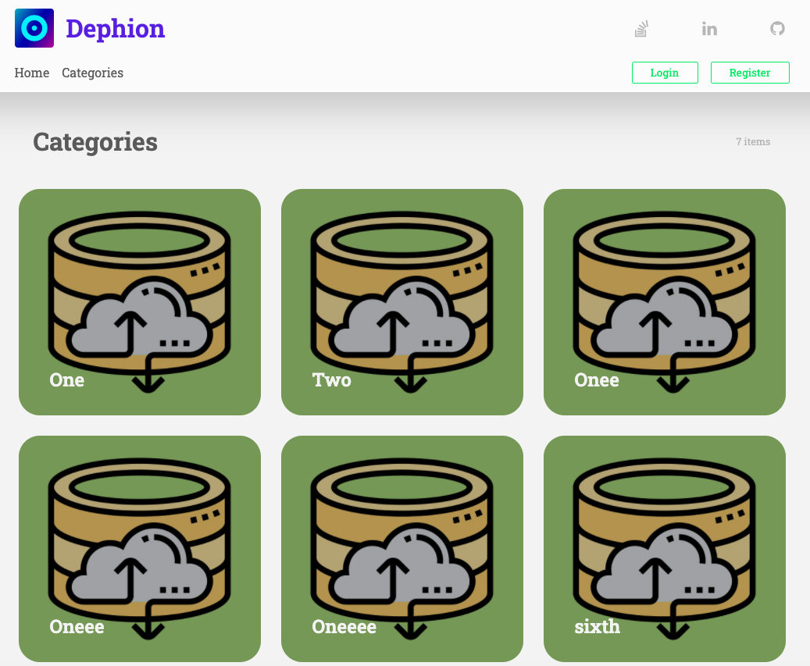

# dephion Code challenge

This is a simple fullstack Project for a cookbook webapp with React.
This project is containerized with Docker and there is a `dokcer-compose.yml` file in the root directory to manage the services.

There are 3 services involved in this project:

1. Database Service (cookbook_mongo_db)
2. Backend Service (cookbook_backend)
3. Client Service (cookbook_client)

Here is the picture of docker containers which are active:

## Thoughts on this project

first of all before bigining the project, i decided to plan for it and takes me hours to figure out the whole structurea and finally i created this min map of my thoughts on this project which is avaliable at [My Mind Map on This Project](https://coggle.it/diagram/X2JesTfdS29D6YhB/t/cookbook)

this was really **important step** for me, because it directs me in my way of building the project!

## Introduction

In this project i chhosed to use MERN stack, for Database i used mongoDb, because it mixes well with nodejs, for backend i used NodeJs with and the casual `mongoose` ORM, for client side i used React and Redux with styled-components for styling.

I created a RestFull API for backend and definitely it could be scaled as a graphQl service ( may be next step on this project ;), and i used Joi in my source code to validate data that comes with request in order to get clean input from client side to prevent insert the bad data to databse. i created the user flow for this project in a session less way with JWT and when you login to the app, it will give you a JWT token which will expires in 30 days, and for refresh token, i tried to take it simple and did not implement it for the sake of time!

also i did not created the DTOs for domain and resources, just to handle the backend as fast as possible.

it is worth noting that there is a directory at `server/postman` which includes two files, the post man collection, and the postman environment. you can import them and use the RestFull Api provided by backend container!
Here is the picture of postman collection:

for the client side i used the container way of structuring the project and put commonly used components in to the `client/src/components` folder, I lazy load each Containers redux state and since then i worked my entire project in modular way that each container has its own redux folder and other stuff like context , styles and other ones to make it easily managable!

some of stuff that i did in client side that worth mentioning:

- used immer for having a great performance on updating the store
- used formik for managing the forms
- used Yup for validationg the form inputs that mixes well with Formik
- used `redux-persist` in order to persist the global user data in user session
- and many more...

So lets dive in to the booting the project up!

## How to Run the Project?

Pre requisits:

- you need to install Docker in your Computer! [Check This Page](https://docs.docker.com/get-docker/)
- you need to install the Dokcer-compose [check here](https://docs.docker.com/compose/install/)
- have postman app installed on you computer [install it from here](https://www.postman.com/downloads/)

also no that I have included the `.env` files in this project, so there is no need to do any thing ( im aware that i should not do this, and how bad practice it is, but i wanted to make the steps easy as possible )

Steps :

1. clone the repo first
2. navigate to the project directory and run `docker-compose ud -d`, this step would take a bit time because it will get the mongoDb image and will create the services(both client and backend) for you
3. If that was successfull and you did that well, open up a terminal to check they are ok by writing this command `docker ps`, you should see somthing like this:

4. after that you need to open the postman and import the collection and environment provided for you at `server/postman`, importing is so easy for importing the collection you need to click on this button:
   

   and for importing the environment, you need to click on this button:

   

   a modal will be openend, you need to scroll down and click on import button:

   

   and choode the environment file that is been provided at `server/postman`

5. **THIS IS VERY IMPORTANT**: in this step you need to create some category, because of time, i was unable to develop the adding category form from client side and you need to call an API in order to create a category, for creating the category, you need to do this steps, first open up the `http://localhost:4000/auth?type=register` and create your user, then in post mand try to use `v1.0/user/login` to login with your credentials! (this simple). after doing that you can create category using this api: `v1.0/category/createCategory`
   
   just create one or two category please!
6. You Did It, now you can open the `http://localhost:4000/` and check the different stuff in client side:

here is the list of Services:

- mongoDb is on PORT 27021 avaliable with user:root, pass: examplePass
- backend is avaliable on `http://localhost:4010/api/v1.0/`
- client is ready on `http://localhost:4000/`

---

Here are some screenshots of the Project:

Home Page

Category List Page

Recipe Page

Recipe Update Page

## What I might do in next step:

also there is alot of improvments i can make on this:

1. using typescript
2. use snapshot, unit and integration test in client side also for backend side might use unit and integration tests ( this is a must!, but for lack of time i could not implement it)
3. this is not a bug free application, of course there would be some bugs, and i should resolve them first
4. making it responsive is a priority to all of them :)

In any case if you encountered any kind of error, Im fully at your desposal!

Hope you Best!  
Ahmad (@a_m_dev)
